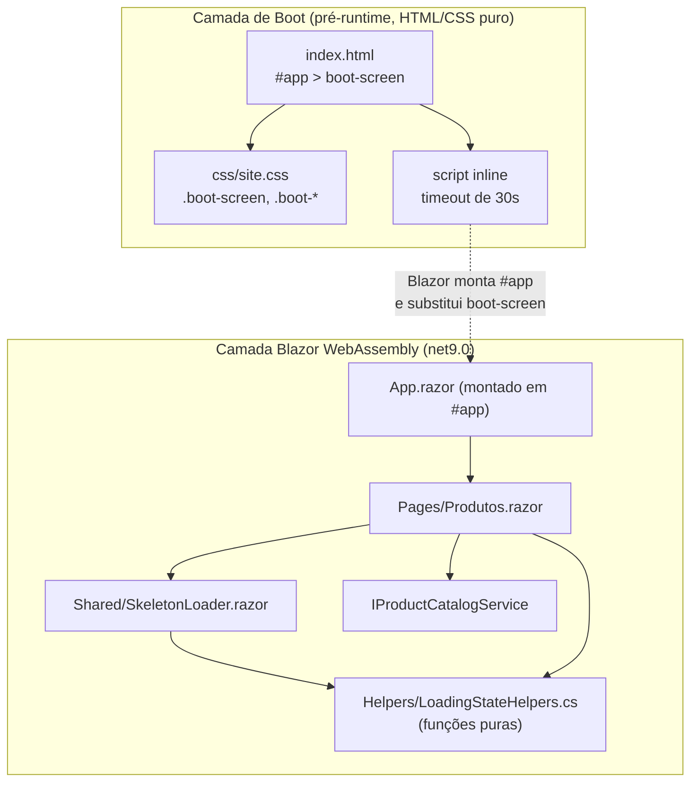
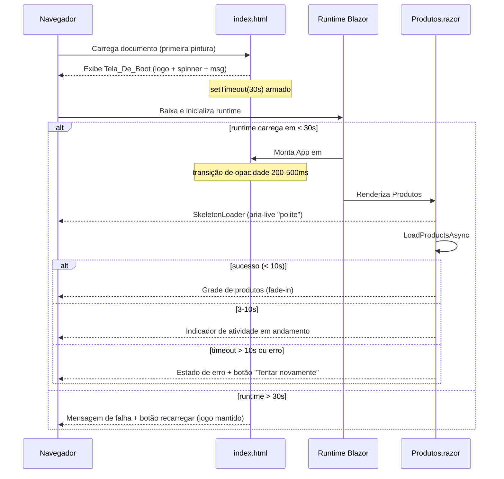

# Design Document

## Overview

Este documento descreve o design técnico da funcionalidade **loading-experience** para o site institucional MaterDomus, uma aplicação **Blazor WebAssembly** (net9.0). O objetivo é aprimorar a experiência de carregamento em dois momentos distintos, mantendo a identidade de marca (tipografia `system-ui`, cor de texto `#222`, bordas `#eaeaea`, raio de borda `6px` e cor de destaque `#ff9900`):

1. **Tela de boot da aplicação** — a tela exibida dentro de `<div id="app">` em `wwwroot/index.html` enquanto o runtime Blazor WebAssembly é baixado e inicializado. Como ela aparece **antes** do runtime carregar, deve ser 100% HTML/CSS estático, sem qualquer dependência do runtime Blazor (Requisito 1, 3, 4, 5).
2. **Estado de carregamento de conteúdo na página de Produtos** — substitui o spinner simples atual por um **esqueleto de carregamento** (skeleton) que reproduz a grade de cartões de produto, com transições suaves, acessibilidade e tratamento de carregamento prolongado (Requisitos 2, 3, 4, 5, 6).

### Decisões-chave e justificativas

- **A tela de boot é substituída "de graça" pelo mecanismo de mount do Blazor.** O `Program.cs` registra `builder.RootComponents.Add<App>("#app")`, ou seja, o componente raiz é montado dentro de `<div id="app">`. Quando o primeiro componente Blazor renderiza, o Blazor **substitui o innerHTML** de `#app`, removendo naturalmente o markup de boot. Isso satisfaz o Requisito 1.5 (remoção após primeira renderização) sem código de limpeza manual. A transição de opacidade (Requisito 3.1) é aplicada via CSS no próprio `#app`.
- **Markup de boot inline no `index.html` + estilos em `css/site.css`.** Satisfaz os Requisitos 1.6 e 1.7: renderiza na primeira pintura sem depender do runtime. O `logo.png` é uma imagem estática servida diretamente pelo host.
- **Timeout de boot via `setTimeout` puro em `index.html`.** Como o runtime pode falhar em carregar (Requisito 1.8), um pequeno script inline (não-Blazor) monitora um flag e, após 30s, exibe a mensagem de falha e o botão de recarregar. O flag é limpo pelo próprio Blazor ao iniciar.
- **Componente Blazor reutilizável `SkeletonLoader`** para o estado de conteúdo. Encapsula a grade de placeholders, região `aria-live`, indicador de progresso e lógica de "carregamento prolongado". Reutilizável em outras páginas no futuro.
- **Extração de lógica pura para helpers testáveis.** A lógica de decisão do estado de carregamento (fase inicial / prolongado / erro / sucesso, contagem de placeholders, mensagens) é isolada em funções puras para permitir teste baseado em propriedades, separando-a do I/O e da renderização.

## Architecture

A funcionalidade se divide em duas camadas independentes que compartilham apenas tokens de marca (variáveis CSS):



### Fluxo temporal do carregamento



## Components and Interfaces

### 1. Tela de boot (`wwwroot/index.html` + `wwwroot/css/site.css`)

O conteúdo de `<div id="app">Carregando...</div>` é substituído por markup estruturado. Toda a estilização vive em `css/site.css` (já referenciado no `<head>`), sem estilos que dependam do runtime.

Estrutura HTML proposta dentro de `#app`:

```html
<div id="app">
  <div class="boot-screen" id="boot-screen">
    
    <div class="boot-screen__spinner" aria-hidden="true"></div>
    <p class="boot-screen__message">Carregando MaterDomus...</p>

    <!-- Estado de falha (oculto por padrão) -->
    <div class="boot-screen__error" id="boot-error" hidden>
      <p>Não foi possível carregar o site. Verifique sua conexão.</p>
      <button type="button" onclick="location.reload()">Recarregar página</button>
    </div>
  </div>
</div>
```

Script inline (não-Blazor) para o timeout de 30s (Requisito 1.8):

```html
<script>
  window.__bootTimer = setTimeout(function () {
    var spinner = document.querySelector('.boot-screen__spinner');
    var msg = document.querySelector('.boot-screen__message');
    var err = document.getElementById('boot-error');
    if (spinner) spinner.style.display = 'none';
    if (msg) msg.style.display = 'none';
    if (err) err.hidden = false;
    // Logo permanece visível.
  }, 30000);
</script>
```

Como o Blazor substitui o innerHTML de `#app` ao montar `App`, o `.boot-screen` (e seu timer visual) desaparecem naturalmente. O `clearTimeout(window.__bootTimer)` é disparado no `OnAfterRenderAsync` do primeiro componente via JS interop leve **ou**, de forma mais simples e sem interop, o timer só afeta o DOM se `.boot-screen` ainda existir — como o Blazor já removeu esse markup, o `if (spinner)` retorna `null` e o timer é inócuo. Optamos por esta abordagem sem interop para manter a camada de boot totalmente desacoplada do runtime.

Tokens de estilo relevantes (em `css/site.css`):

- `.boot-screen`: `position: fixed; inset: 0; display: flex; flex-direction: column; align-items: center; justify-content: center; background: #fff; color: #222; font-family: system-ui, sans-serif;`
- `.boot-screen__spinner`: animação `spin` com ciclo entre 0,5s e 2s (usaremos `0.8s`, dentro do intervalo do Requisito 1.2), cor de destaque `#ff9900` na borda superior.
- `.boot-screen__message`: `max-width` para respeitar ≤ 60 caracteres da mensagem.
- Transição de opacidade em `#app` (ver Correctness / Transições).

### 2. `Shared/SkeletonLoader.razor` (novo componente Blazor)

Componente reutilizável que renderiza o estado de carregamento de conteúdo.

Parâmetros:

| Parâmetro | Tipo | Descrição |
|-----------|------|-----------|
| `PlaceholderCount` | `int` | Número de cartões placeholder (entre 4 e 12; padrão 6). Requisito 2.1 |
| `Message` | `string` | Mensagem textual de carregamento (≤ 60 caracteres). Requisito 2.2, 4.1 |
| `ShowProlongedIndicator` | `bool` | Ativa indicação de atividade prolongada (3–10s). Requisito 6.3 |

Estrutura de renderização (esqueleto):

```razor
<div class="skeleton" role="status" aria-live="polite">
    <div class="skeleton__grid" aria-hidden="true">
        @for (var i = 0; i < ClampCount(PlaceholderCount); i++)
        {
            <div class="skeleton-card">
                <div class="skeleton-card__image"></div>
                <div class="skeleton-card__line skeleton-card__line--short"></div>
                <div class="skeleton-card__line"></div>
                <div class="skeleton-card__line skeleton-card__line--price"></div>
            </div>
        }
    </div>
    <p class="skeleton__message">
        @Message
        @if (ShowProlongedIndicator)
        {
            <span class="skeleton__prolonged" aria-hidden="true"> · ainda carregando</span>
        }
    </p>
</div>
```

- A grade placeholder é decorativa → `aria-hidden="true"` (Requisito 4.7).
- A região `role="status" aria-live="polite"` contém a mensagem textual (Requisito 4.1, 4.2).
- `ClampCount` limita ao intervalo [4, 12] (Requisito 2.1).

### 3. `Helpers/LoadingStateHelpers.cs` (novo, funções puras)

Isola a lógica testável, separada de I/O e renderização.

```csharp
public enum LoadingPhase { Initial, Prolonged, Success, Error }

public static class LoadingStateHelpers
{
    // Requisito 2.1 — mantém a contagem no intervalo [4, 12]
    public static int ClampPlaceholderCount(int requested);

    // Requisitos 6.1, 6.3 — deriva a fase a partir do tempo decorrido e do resultado
    // elapsed em segundos; loaded/errored refletem o estado do carregamento
    public static LoadingPhase DerivePhase(double elapsedSeconds, bool completed, bool errored);

    // Requisitos 1.3, 2.2 — valida/normaliza mensagens (≤ 60 caracteres)
    public static bool IsValidLoadingMessage(string message);
}
```

Regras:
- `ClampPlaceholderCount`: retorna `Math.Clamp(requested, 4, 12)`.
- `DerivePhase`:
  - `errored == true` ou `elapsedSeconds > 10` sem completar → `Error` (Requisito 6.1).
  - `completed == true` → `Success`.
  - `elapsedSeconds >= 3 && elapsedSeconds <= 10` → `Prolonged` (Requisito 6.3).
  - caso contrário → `Initial`.
- `IsValidLoadingMessage`: verdadeiro quando não vazia e `Length <= 60`.

### 4. `Pages/Produtos.razor` (modificações)

Substitui o bloco `_isLoading` atual pelo `SkeletonLoader` e integra o tratamento de carregamento prolongado (Requisito 6):

- Mantém o `CancellationTokenSource` e o padrão `Task.WhenAny` já existentes.
- Adiciona um `System.Timers.Timer`/`PeriodicTimer` (ou marca de tempo com `StateHasChanged`) para detectar a faixa de 3–10s e ativar `ShowProlongedIndicator` (Requisito 6.3).
- Ao concluir com sucesso, atualiza a região `aria-live` com mensagem de conclusão (Requisito 4.3) e aplica fade-in da grade (Requisito 3.2).
- Ao falhar ou exceder 10s, remove o esqueleto, atualiza `aria-live` com a falha (Requisito 4.4, 2.5) e exibe o estado de erro com o botão "Tentar novamente" (Requisito 6.1). O `RetryLoad` existente reinicia o carregamento (Requisito 6.2). Não há limite de tentativas (Requisito 6.4) — o fluxo é idempotente e reentrante.

### 5. Estilos do esqueleto (`wwwroot/css/produtos.css`)

Reaproveita as variáveis existentes (`--card-border`, `--card-radius`, `--border-radius`). Novas classes:

- `.skeleton__grid`: mesma grade responsiva de `.products-grid` (1/2/3 colunas).
- `.skeleton-card`: `border: var(--card-border); border-radius: var(--card-radius);` (Requisito 2.4).
- `.skeleton-card__image` / `.skeleton-card__line`: blocos com animação de "shimmer" (gradiente animado).
- Transições de opacidade para grade e esqueleto (Requisito 3.2).

## Data Models

Esta funcionalidade introduz apenas estruturas de estado de UI; nenhum modelo persistido é alterado.

```csharp
// Fase do ciclo de carregamento de conteúdo
public enum LoadingPhase { Initial, Prolonged, Success, Error }
```

Estado interno de `Produtos.razor` (campos):

| Campo | Tipo | Papel |
|-------|------|-------|
| `_isLoading` | `bool` | Indica esqueleto ativo (já existente) |
| `_hasError` | `bool` | Indica estado de erro (já existente) |
| `_isProlonged` | `bool` | Ativa indicação de atividade prolongada (novo, Requisito 6.3) |
| `_ariaMessage` | `string` | Texto atual da região `aria-live` (novo, Requisito 4.2–4.4) |
| `_cts` | `CancellationTokenSource` | Cancelamento/timeout (já existente) |

Constantes de marca (tokens): `system-ui`, `#222`, `#eaeaea`, `6px`, `#ff9900` — aplicadas via CSS, não como dados de runtime.

## Correctness Properties

*Uma propriedade é uma característica ou comportamento que deve ser verdadeiro em todas as execuções válidas de um sistema — essencialmente, uma afirmação formal sobre o que o sistema deve fazer. Propriedades servem como ponte entre especificações legíveis por humanos e garantias de correção verificáveis por máquina.*

A maior parte desta funcionalidade envolve renderização de UI, CSS estático (tela de boot, esqueleto, transições, `prefers-reduced-motion`) e integração com serviços — que são melhor cobertos por testes de exemplo/snapshot e testes de renderização (bUnit), e não por testes baseados em propriedades. As propriedades abaixo cobrem exclusivamente a **lógica pura** extraída para `LoadingStateHelpers`, onde o comportamento varia de forma significativa com a entrada.

### Property 1: Contagem de placeholders sempre no intervalo válido

*Para todo* inteiro `n` de entrada, `ClampPlaceholderCount(n)` retorna um valor no intervalo fechado [4, 12], e retorna o próprio `n` quando `n` já pertence a [4, 12].

**Validates: Requirements 2.1**

### Property 2: Falha ou timeout sempre resulta em estado de erro

*Para todo* tempo decorrido `t >= 0` e quaisquer flags de conclusão, se o carregamento falhou (`errored`) ou `t > 10` sem ter concluído, então `DerivePhase` retorna `Error`.

**Validates: Requirements 6.1, 2.5**

### Property 3: Classificação de fase é total e determinística

*Para todo* par `(t, completed, errored)` válido, `DerivePhase` retorna exatamente uma fase de `LoadingPhase` e produz sempre o mesmo resultado para a mesma entrada (função total e determinística), sem estados indefinidos.

**Validates: Requirements 6.1, 6.3**

### Property 4: Faixa de carregamento prolongado é sinalizada

*Para todo* tempo decorrido `t` com `3 <= t <= 10`, quando o carregamento ainda não concluiu nem falhou, `DerivePhase` retorna `Prolonged`; e para `0 <= t < 3` (não concluído, sem erro) retorna `Initial`.

**Validates: Requirements 6.3**

### Property 5: Validação de mensagem de carregamento respeita o limite

*Para toda* string `s`, `IsValidLoadingMessage(s)` é verdadeiro se e somente se `s` for não vazia e tiver no máximo 60 caracteres.

**Validates: Requirements 1.3, 2.2**

## Error Handling

- **Falha no boot do runtime (Requisito 1.8):** tratada inteiramente na camada HTML/CSS/JS de `index.html`. Após 30s sem o Blazor montar `#app`, o script inline oculta spinner e mensagem, exibe `#boot-error` (mensagem em português + botão "Recarregar página") e mantém o logo visível. Não depende do runtime.
- **Falha ou timeout do catálogo (Requisitos 2.5, 6.1):** `Produtos.razor` já usa `Task.WhenAny(loadTask, timeoutTask)` com timeout de 10s e captura de exceções. Ao detectar falha/timeout: `_isLoading = false`, `_hasError = true`, esqueleto removido, grade não renderizada, `aria-live` atualizado com mensagem de falha, estado de erro com botão "Tentar novamente".
- **Retry (Requisitos 6.2, 6.4):** `RetryLoad` chama `LoadProductsAsync`, que cancela o `CancellationTokenSource` anterior, cria um novo e reinicia o fluxo. Reentrante e sem limite de tentativas.
- **Transição interrompida (Requisito 3.3):** o estado final é sempre o conteúdo com opacidade 100%. Como o alvo do `transition` de opacidade é `1` (100%), a interrupção deixa o elemento no estado final visível; o `.boot-screen`/esqueleto são removidos do fluxo pelo mount do Blazor / troca de branch do Razor (`@if`), garantindo que não permaneçam visíveis mesmo se a animação falhar.
- **Logo sem texto alternativo (Requisito 4.6):** quando não houver `alt` descritivo, o `` recebe `aria-hidden="true"`. Na prática usaremos sempre `alt="MaterDomus"` (Requisito 4.5, ≤ 125 caracteres).

## Testing Strategy

### Abordagem dual

- **Testes de exemplo / renderização (bUnit + xUnit):** para UI, acessibilidade e CSS. O projeto `MaterDomus.Tests` já usa xUnit com testes de renderização (`ProductCardRenderTests`, `BottomNavRenderTests`, `CssCriticalRulesTests`).
- **Testes baseados em propriedades (PBT):** apenas para a lógica pura de `LoadingStateHelpers`.

### Testes de exemplo / renderização

- **Boot screen (Requisitos 1, 4.5, 4.6, 5.1):** teste que lê `wwwroot/index.html` e `css/site.css` (à la `CssCriticalRulesTests`) e verifica: presença de `images/logo.png` com `alt`; presença de spinner com `aria-hidden`; mensagem ≤ 60 caracteres; bloco de erro presente e oculto; existência de regra `@media (prefers-reduced-motion: reduce)` desativando animação/transição (Requisitos 5.1, 5.4, 3.4).
- **SkeletonLoader (Requisitos 2, 4.1, 4.7):** testes bUnit verificando que a grade tem entre 4 e 12 cartões, que a grade é `aria-hidden`, que existe região `aria-live="polite"` com a mensagem, e que o número de placeholders respeita `PlaceholderCount`.
- **Produtos.razor (Requisitos 2.3, 2.5, 4.3, 4.4, 6.1, 6.2):** testes bUnit com um `IProductCatalogService` fake para exercitar sucesso, erro e timeout, verificando a troca de branch (esqueleto → grade / erro) e o conteúdo da região `aria-live`.
- **CSS de transições e movimento reduzido (Requisitos 3, 5):** testes de string sobre `site.css`/`produtos.css` confirmando durações entre 200–500ms e a presença das regras de `prefers-reduced-motion`.

### Testes baseados em propriedades

- **Biblioteca:** [FsCheck](https://fscheck.github.io/FsCheck/) (via `FsCheck.Xunit`), a escolha padrão de PBT para o ecossistema .NET/xUnit. **Não** implementar PBT do zero.
- **Configuração:** mínimo de **100 iterações** por propriedade (`[Property(MaxTest = 100)]`).
- **Cobertura:** uma única propriedade por item da seção Correctness Properties (Properties 1–5), todas sobre `LoadingStateHelpers`.
- **Tag de cada teste (comentário):** `// Feature: loading-experience, Property {number}: {property_text}`.

Exemplo de tag/estrutura:

```csharp
// Feature: loading-experience, Property 1: Contagem de placeholders sempre no intervalo válido
[Property(MaxTest = 100)]
public Property ClampPlaceholderCount_StaysInRange(int n)
{
    var result = LoadingStateHelpers.ClampPlaceholderCount(n);
    return (result >= 4 && result <= 12).ToProperty();
}
```

### Equilíbrio

- Testes unitários/de exemplo focam em pontos de integração, casos de borda e renderização/acessibilidade.
- Testes de propriedade focam na lógica pura de classificação de fase, clamp de contagem e validação de mensagem — onde a variação de entrada revela casos de borda (limites 3s, 10s, 4, 12, 60 caracteres).
