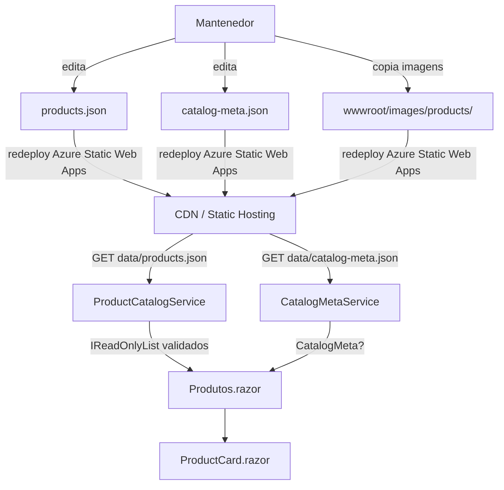

# Design Document — product-catalog-amazon-sync

## Overview

Esta feature substitui o catálogo de demonstração do site institucional MaterDomus por dados reais dos produtos vendidos pela loja MaterDomus na Amazon Brasil (seller `A20TN3HCSY6KZV`). O site é uma aplicação **Blazor WebAssembly (.NET 9)** hospedada como site estático no Azure Static Web Apps — sem backend próprio, sem servidor de aplicação e sem banco de dados.

Os dados de produto são servidos como arquivo JSON estático em `wwwroot/data/products.json`. A "sincronização" é, portanto, um **processo editorial** (curadoria manual): um mantenedor consulta a Vitrine Amazon, coleta os dados, atualiza o JSON e as imagens, e faz o redeploy dos arquivos estáticos. Não há automação via API da Amazon — o design reflete isso.

O escopo de mudanças inclui:

1. **Validação de integridade** dos registros carregados do JSON (campos obrigatórios, formato de `amazonUrl`, preço positivo) executada no cliente Blazor.
2. **Arquivo de metadados** `wwwroot/data/catalog-meta.json` para rastreabilidade da última curadoria.
3. **Guia de atualização** `wwwroot/data/CATALOG_UPDATE.md` com o processo passo a passo.
4. **Imagens locais** em `wwwroot/images/products/` com fallback para placeholder.
5. Ajustes na UI para refletir o catálogo validado e os metadados de sincronização.



---

## Architecture

O site opera inteiramente no browser. Não há chamadas a APIs externas em runtime — toda a lógica de negócio é executada no cliente WebAssembly.

```mermaid
graph LR
    subgraph Browser
        direction TB
        PA[Produtos.razor] --> PCS[ProductCatalogService]
        PA --> CMS[CatalogMetaService]
        PA --> FS[FavoritesService]
        PC[ProductCard.razor] --> FS
        PA --> PC
    end

    subgraph "Azure Static Web Apps CDN"
        JSON1[data/products.json]
        JSON2[data/catalog-meta.json]
        IMG[images/products/*.webp|*.jpg]
    end

    PCS -->|HttpClient GET| JSON1
    CMS -->|HttpClient GET| JSON2
    PC -->|img src| IMG
```

### Princípios arquiteturais mantidos

- **Sem backend**: toda lógica roda no cliente WASM. Sem servidor intermediário.
- **Dados imutáveis por sessão**: `ProductCatalogService` cacheia a lista em memória; um reload da página busca dados frescos.
- **Substituição completa**: o `products.json` é sempre substituído por inteiro na curadoria — nunca por patch incremental.
- **Validação no cliente**: registros inválidos são filtrados silenciosamente antes de chegar ao componente de UI.
- **Graceful degradation**: falhas de rede ou JSON inválido resultam em estado de erro amigável, nunca em exceção propagada.

---

## Components and Interfaces

### ProductCatalogService (existente — expandir)

Responsabilidade atual: carregar `products.json` via `HttpClient` e cachear em memória.

**Expansão necessária**: aplicar a lógica de validação de integridade (Requisito 6) logo após a desserialização, antes de cachear.

```csharp
public class ProductCatalogService : IProductCatalogService
{
    // Após desserialização, filtrar registros inválidos:
    private static IReadOnlyList<Product> Validate(List<Product>? raw)
    {
        if (raw is null) return Array.Empty<Product>();

        var seen = new HashSet<string>();
        var valid = new List<Product>();

        foreach (var p in raw)
        {
            // Req 6.1: campos obrigatórios não-vazios e price > 0
            if (string.IsNullOrWhiteSpace(p.Id)   ||
                string.IsNullOrWhiteSpace(p.Name)  ||
                p.Price <= 0m)
                continue;

            // Req 2.7 / 2.8: price e imageUrl obrigatórios
            if (string.IsNullOrEmpty(p.ImageUrl))
                continue;

            // Req 1.5 / 3.1: formato amazonUrl válido
            if (!IsValidAmazonUrl(p.AmazonUrl))
                continue;

            // Req 6.2: descartar duplicatas (manter primeiro)
            if (!seen.Add(p.Id))
            {
                Console.Warn($"[ProductCatalogService] ID duplicado descartado: {p.Id}");
                continue;
            }

            valid.Add(p);
        }

        return valid;
    }

    private static readonly Regex AsinPattern =
        new(@"^https://www\.amazon\.com\.br/dp/[A-Z0-9]{10}$",
            RegexOptions.Compiled);

    internal static bool IsValidAmazonUrl(string? url) =>
        !string.IsNullOrEmpty(url) && AsinPattern.IsMatch(url);
}
```

### CatalogMetaService (novo)

Carrega e desserializa `catalog-meta.json`. Em caso de arquivo ausente, JSON inválido ou campos faltantes, retorna `null` sem propagar exceção (Requisito 4.5).

```csharp
public interface ICatalogMetaService
{
    Task<CatalogMeta?> GetMetaAsync();
}

public class CatalogMetaService : ICatalogMetaService
{
    private readonly HttpClient _http;

    public async Task<CatalogMeta?> GetMetaAsync()
    {
        try
        {
            var meta = await _http.GetFromJsonAsync<CatalogMeta>("data/catalog-meta.json");
            // Validar campos obrigatórios
            if (meta is null ||
                string.IsNullOrEmpty(meta.CuratedAt) ||
                string.IsNullOrEmpty(meta.SourceUrl) ||
                meta.ProductCount < 0)
                return null;
            return meta;
        }
        catch
        {
            return null;
        }
    }
}
```

### Produtos.razor (existente — ajuste menor)

Adicionar exibição opcional dos metadados de sincronização quando `CatalogMeta` estiver disponível. A lógica de filtro e o grid não mudam.

### ProductCard.razor (existente — sem mudança)

Já implementa o fallback de imagem via `onerror` JavaScript e exibe o botão Amazon somente quando `AmazonUrl` não é vazio.

### ProductHelpers (existente — sem mudança)

`TruncateDescription` e `FormatPrice` permanecem inalterados.

---

## Data Models

### Product (existente — sem mudança de estrutura)

```csharp
public record Product(
    string Id,           // slug único, ex: "organizador-gaveta-001"
    string Name,         // 1–100 caracteres
    string Description,  // 1–500 caracteres; UI trunca em 120
    string ImageUrl,     // caminho relativo "images/products/{id}.webp" ou URL absoluta
    string Category,     // "Organização" | "Cozinha" | "Casa" | "Limpeza"
    decimal Price,       // > 0, precisão 2 casas decimais
    string AmazonUrl     // "https://www.amazon.com.br/dp/{ASIN}" onde ASIN = [A-Z0-9]{10}
);
```

**Regras de validação do cliente** (aplicadas em `ProductCatalogService.Validate`):

| Campo | Regra |
|---|---|
| `Id` | Não nulo, não vazio após trim |
| `Name` | Não nulo, não vazio após trim |
| `Price` | Decimal > 0 |
| `ImageUrl` | Não nulo, não vazio |
| `AmazonUrl` | Regex `^https://www\.amazon\.com\.br/dp/[A-Z0-9]{10}$` |
| `Id` | Único na lista (manter primeiro, descartar duplicatas) |

### CatalogMeta (novo)

```csharp
public record CatalogMeta(
    string CuratedAt,     // ISO 8601 date, ex: "2025-01-15"
    string SourceUrl,     // URL da Vitrine Amazon
    int    ProductCount   // contagem de produtos ativos no products.json
);
```

**Mapeamento JSON** (System.Text.Json com `JsonPropertyName`):

```json
{
  "curatedAt": "2025-01-15",
  "sourceUrl": "https://www.amazon.com.br/s?me=A20TN3HCSY6KZV&marketplaceID=A2Q3Y263D00KWC",
  "productCount": 8
}
```

### products.json (estrutura existente — sem mudança de schema)

Array de objetos `Product`. Cada campo mapeado por nome camelCase (padrão do `System.Text.Json`).

### catalog-meta.json (novo arquivo)

Arquivo criado manualmente pelo mantenedor durante cada curadoria. Localização: `wwwroot/data/catalog-meta.json`.

### CATALOG_UPDATE.md (novo arquivo)

Guia de atualização editorial. Localização: `wwwroot/data/CATALOG_UPDATE.md`.

---

## Correctness Properties

*Uma propriedade é uma característica ou comportamento que deve ser verdadeiro em todas as execuções válidas do sistema — essencialmente, um enunciado formal sobre o que o sistema deve fazer. Propriedades servem como ponte entre especificações legíveis por humanos e garantias de correção verificáveis por máquinas.*

PBT é aplicável nesta feature porque as funções centrais de validação (`Validate` e `IsValidAmazonUrl`) são puras, com input/output bem definido, e o espaço de entradas é vasto (combinações de validade de campos, tamanho de listas, strings de URL). Para os requisitos de processo editorial e de UI, PBT não é aplicável — esses são cobertos por testes de exemplo, smoke tests e bunit.

**Reflexão antes de escrever as propriedades:**

Requisitos 1.5, 2.7, 2.8, 6.1 e 6.3 convergem para a mesma função `Validate`. Em vez de escrever uma propriedade por campo inválido, uma propriedade mais geral com um gerador que cobre todas as formas de invalidade (price ≤ 0, imageUrl vazia, amazonUrl inválida, id/name vazios) é mais econômica e cobre o mesmo espaço. A Property 5 (idempotência) verifica `f(f(x)) = f(x)` e não é redundante com a Property 1 — ela detecta bugs em que a segunda passagem de validação altera o resultado. As Properties 2, 3 e 4 cobrem aspectos distintos (deduplicação, fronteira do regex, resiliência do serviço de metadados).

---

### Property 1: Validação — filtra exatamente os inválidos, preserva todos os válidos

*Para qualquer* lista mista de produtos (com registros válidos e inválidos intercalados em qualquer ordem e proporção), a função `Validate` deve retornar exatamente os produtos cujos campos `id`, `name` são não-vazios após trim, `price` > 0, `imageUrl` é não-vazia, e `amazonUrl` corresponde ao padrão `https://www.amazon.com.br/dp/[A-Z0-9]{10}` — nem mais, nem menos, independentemente da posição dos registros inválidos na lista.

**Validates: Requirements 1.5, 2.7, 2.8, 6.1, 6.3**

---

### Property 2: Deduplicação preserva o primeiro e descarta os demais

*Para qualquer* lista de produtos que contenha IDs duplicados em qualquer posição, a função `Validate` deve manter somente o registro com o menor índice de array para cada ID repetido, descartando todos os registros subsequentes com o mesmo `id`.

**Validates: Requirements 6.2**

---

### Property 3: IsValidAmazonUrl — correção na fronteira do formato canônico

*Para qualquer* string, `IsValidAmazonUrl` deve retornar `true` se e somente se a string for exatamente `https://www.amazon.com.br/dp/` seguido de exatamente 10 caracteres alfanuméricos maiúsculos (`[A-Z0-9]{10}`) e nada mais — rejeitando ASINs com 9 ou 11 caracteres, letras minúsculas no ASIN, parâmetros de query extras, esquemas diferentes, domínios diferentes, e strings vazias.

**Validates: Requirements 1.5, 3.1, 3.4**

---

### Property 4: CatalogMetaService — nunca propaga exceção para qualquer resposta HTTP

*Para qualquer* resposta HTTP recebida ao solicitar `catalog-meta.json` — incluindo status 404, 500, corpo vazio, JSON sintaticamente inválido, JSON válido com campos obrigatórios ausentes, `productCount` negativo, ou exceção de rede — `CatalogMetaService.GetMetaAsync` deve retornar `null` sem lançar exceção.

**Validates: Requirements 4.5**

---

### Property 5: Validate é idempotente

*Para qualquer* lista de produtos, aplicar `Validate` duas vezes consecutivas deve produzir resultado idêntico a aplicar uma única vez — ou seja, `Validate(Validate(list))` deve ser equivalente a `Validate(list)`.

**Validates: Requirements 6.1, 6.3**

---

## Error Handling

### Falhas de rede ao carregar products.json

O `ProductCatalogService` já captura todas as exceções, loga no console e retorna lista vazia. A `Produtos.razor` já exibe o estado de erro com botão "Tentar novamente" quando `_hasError` é verdadeiro. A lógica de timeout de 10 segundos já está implementada.

**Nenhuma mudança necessária** nessa camada.

### JSON inválido em products.json

Já coberto pelo bloco `catch` do `ProductCatalogService`. Retorna lista vazia; UI exibe estado de erro.

### Registros inválidos no products.json (JSON válido, dados inválidos)

**Mudança necessária**: a lógica de validação do `ProductCatalogService.Validate` filtrará silenciosamente os registros inválidos. Os produtos válidos restantes serão exibidos normalmente (Requisito 6.3). Se nenhum produto for válido, o comportamento de lista vazia existente se aplica.

### catalog-meta.json ausente ou inválido

`CatalogMetaService.GetMetaAsync` retorna `null`. A `Produtos.razor` simplesmente omite a seção de metadados de sincronização. Nenhuma mensagem de erro é exibida ao usuário (Requisito 4.5).

### Imagem de produto não encontrada (HTTP 404 ou timeout)

Já coberto pelo atributo `onerror` do `` em `ProductCard.razor`, que substitui `src` por `images/placeholder-product.png`.

### Tabela resumo

| Cenário | Comportamento | Requisito |
|---|---|---|
| Rede indisponível ao carregar products.json | Lista vazia + estado de erro + botão retry | 6.5 |
| products.json com JSON inválido | Lista vazia + estado de erro | 6.5 |
| Registros com campos inválidos | Filtrar silenciosamente; exibir demais | 6.3 |
| Registros com ID duplicado | Manter primeiro; logar aviso no console | 6.2 |
| catalog-meta.json ausente/inválido | Omitir seção de metadados; sem erro | 4.5 |
| Imagem de produto não encontrada | Exibir placeholder | 5.3 |
| amazonUrl inválida | Produto filtrado; não exibido | 1.5, 3.4 |

---

## Testing Strategy

### Abordagem dual

- **Testes unitários/propriedade**: cobrem a lógica pura de validação, formatação e filtragem.
- **Testes de integração**: cobrem o carregamento HTTP, cache e desserialização do `ProductCatalogService`.
- **Testes de componente (bunit)**: cobrem rendering do `ProductCard` e estados de `Produtos.razor`.

O projeto já usa **FsCheck 3.2** (property-based testing) e **xUnit 2.9** como base. A estratégia para esta feature segue o mesmo padrão.

### Testes de propriedade (FsCheck)

Cada propriedade deve rodar com `[Property(MaxTest = 100)]`.

**Novos testes necessários:**

| Propriedade | Classe de teste sugerida | Tag |
|---|---|---|
| Property 1: Validação filtra apenas inválidos | `ProductValidationTests` | `Feature: product-catalog-amazon-sync, Property 1` |
| Property 2: Deduplicação preserva primeiro | `ProductValidationTests` | `Feature: product-catalog-amazon-sync, Property 2` |
| Property 3: IsValidAmazonUrl — fronteira | `AmazonUrlValidationTests` | `Feature: product-catalog-amazon-sync, Property 3` |
| Property 4: CatalogMetaService nunca propaga exceção | `CatalogMetaServiceTests` | `Feature: product-catalog-amazon-sync, Property 4` |
| Property 5: Validate é idempotente | `ProductValidationTests` | `Feature: product-catalog-amazon-sync, Property 5` |

**Geradores de dados para FsCheck:**

- `InvalidProductGen()`: gera `Product` com exatamente uma violação de integridade (campo nulo, price ≤ 0, amazonUrl inválida ou id duplicado).
- `ValidProductGen()`: gera `Product` com todos os campos válidos.
- `MixedProductListGen()`: mistura produtos válidos e inválidos em ordem aleatória.
- `AmazonUrlGen()`: gera strings com variação sistemática: formato correto, ASIN com 9 chars, ASIN com 11 chars, letras minúsculas, parâmetros extras, URLs de outros domínios.

### Testes de integração (xUnit, HttpMessageHandler stub)

Novos testes para `CatalogMetaService`:

| Cenário | Verificação |
|---|---|
| Resposta 200 com JSON válido | Retorna `CatalogMeta` com campos corretos |
| Resposta 404 | Retorna `null` sem exceção |
| JSON malformado | Retorna `null` sem exceção |
| Campos obrigatórios ausentes | Retorna `null` sem exceção |
| `productCount` negativo | Retorna `null` sem exceção |

Os testes de `ProductCatalogService` existentes já cobrem carregamento, cache e falha de rede. Adicionar cenários de validação:

| Cenário | Verificação |
|---|---|
| JSON com produto com amazonUrl inválida | Produto filtrado da lista retornada |
| JSON com produto com price = 0 | Produto filtrado da lista retornada |
| JSON com IDs duplicados | Apenas o primeiro mantido |
| JSON com imageUrl vazia | Produto filtrado da lista retornada |

### Testes de componente (bunit)

Os testes existentes em `ProductCardRenderTests.cs` e `BottomNavRenderTests.cs` cobrem rendering básico. Para esta feature:

- Verificar que `ProductCard` não exibe o botão "Comprar na Amazon" quando `AmazonUrl` é vazio (já coberto indiretamente — confirmar).
- Verificar que a seção de metadados de sincronização é omitida em `Produtos.razor` quando `CatalogMeta` é `null`.
- Verificar que a seção de metadados é exibida quando `CatalogMeta` é válido.

### O que NÃO usa PBT

| Componente | Tipo de teste | Motivo |
|---|---|---|
| Rendering de `Produtos.razor` (estados de loading/error) | bunit / exemplo | Comportamento UI determinístico; variação de input não revela novos bugs |
| `catalog-meta.json` bem formado | Exemplo | Verificação de contrato de schema; 1-2 exemplos suficientes |
| `CATALOG_UPDATE.md` existir | Smoke test | Checagem de arquivo estático; não varia com input |
| Abertura de nova aba ao clicar "Comprar na Amazon" | bunit / exemplo | Interação UI com comportamento binário |
