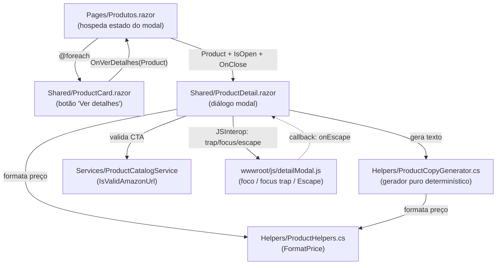

# Design Document

## Overview

Esta funcionalidade adiciona uma **visão de detalhes de produto** ao site vitrine MaterDomus (Blazor WebAssembly, .NET 9). A partir de um botão "Ver detalhes" em cada `ProductCard`, o usuário abre um diálogo modal que apresenta um **texto persuasivo (copywriting)** gerado localmente a partir dos dados do próprio produto, além de nome, categoria, preço e o call-to-action de compra na Amazon.

O design segue dois princípios centrais já estabelecidos no projeto:

1. **Lógica pura e determinística em helpers estáticos testáveis.** A geração do texto persuasivo fica em um novo helper estático — `ProductCopyGenerator` — no diretório `Helpers/`, seguindo exatamente o padrão de `ProductHelpers.TruncateDescription`/`FormatPrice`: função pura, sem dependência de rede, DI, cultura ambiente, hora ou aleatoriedade. Isso a torna trivialmente testável por testes unitários e por testes baseados em propriedade (FsCheck), como já ocorre em `PriceFormattingTests` e `DescriptionTruncationTests`.
2. **Componentes Razor finos que apenas apresentam o resultado.** Um novo componente `ProductDetail.razor` (o diálogo modal) exibe o resultado do gerador e hospeda o CTA_Amazon. A página `Produtos.razor` controla o estado de abertura/fechamento e qual produto está selecionado, sem alterar busca, filtro por categoria ou favoritos.

A acessibilidade (mover foco, focus trap, fechar com Escape e restaurar foco) é implementada com um pequeno módulo de **JS interop** (`wwwroot/js/detailModal.js`), seguindo a convenção já usada por `scrollBehavior.js`, pois o WebAssembly depende de interop com JS para controle confiável de foco no DOM.

### Escopo e decisões-chave

| Decisão | Rationale |
|---|---|
| Gerador de copy é helper estático puro, não serviço com DI | Alinha com `ProductHelpers`; garante determinismo (Req 3.1) e testabilidade sem mocks. |
| Modal hospedado em `Produtos.razor` (não roteado por URL) | A visão de detalhes é uma sobreposição sobre a grade; a grade permanece visível e o estado (busca/filtro/favoritos) é preservado (Req 1.6, 6.7). |
| Foco/focus trap/Escape via JS interop | Blazor WASM não controla foco do DOM de forma confiável só com C#; interop é o padrão do projeto (`scrollBehavior.js`). |
| Reuso de `ProductHelpers.FormatPrice` e `ProductCatalogService.IsValidAmazonUrl` | Evita duplicar regras de formatação (Req 2.5, 3.2) e validação de URL (Req 5.1, 5.4). |

## Architecture

### Estrutura de componentes e responsabilidades



### Fluxo de dados e controle

1. **Abertura.** `ProductCard` expõe um botão "Ver detalhes". Ao acioná-lo, dispara um `EventCallback<Product>` (`OnVerDetalhes`) para `Produtos.razor`.
2. **Resolução.** `Produtos.razor` recebe o `Product` (ou o `Id`) e o localiza em `_allProducts` pelo `Id`. Se resolvido, define `_selectedProduct` e `_isDetailOpen = true`. Se não puder ser resolvido, mantém a grade visível e exibe uma mensagem de indisponibilidade (Req 1.6) — sem abrir o modal.
3. **Renderização.** `ProductDetail.razor` recebe `Product` por `[Parameter]`. Em `OnParametersSet`, chama `ProductCopyGenerator.Generate(product)` para obter o texto persuasivo; formata o preço com `ProductHelpers.FormatPrice`; decide a visibilidade do CTA_Amazon via `ProductCatalogService.IsValidAmazonUrl`.
4. **Acessibilidade.** Após o render (`OnAfterRenderAsync` na primeira renderização com o modal aberto), o componente invoca `detailModal.open(dialogElement, dotNetRef)` no JS, que: move o foco para o primeiro elemento focável (≤ 500 ms), instala o focus trap e o listener de Escape.
5. **Fechamento.** Botão de fechar, Escape (via callback JS `[JSInvokable] OnEscapePressed`) ou clique no backdrop chamam `Close()`. O componente invoca `detailModal.close()` (remove listeners) e dispara `OnClose` para `Produtos.razor`, que zera o estado. O foco é restaurado ao botão "Ver detalhes" de origem; se este não existir mais, o foco vai para um elemento estável da grade (Req 6.6).

### Camadas

- **Apresentação:** `Produtos.razor`, `ProductCard.razor`, `ProductDetail.razor`.
- **Lógica pura:** `ProductCopyGenerator` (novo) e `ProductHelpers` (existente).
- **Validação reutilizada:** `ProductCatalogService.IsValidAmazonUrl` (existente, `internal static` — acessível no mesmo assembly).
- **Interop:** `detailModal.js`.

## Components and Interfaces

### 1. `Helpers/ProductCopyGenerator.cs` (novo, estático puro)

Responsável por produzir o `Texto_Persuasivo` de forma determinística a partir de um `Product`. Segue o padrão de `ProductHelpers`: `static class`, sem estado, sem I/O.

```csharp
namespace MaterDomus.Web.Helpers;

public static class ProductCopyGenerator
{
    /// <summary>
    /// Gera texto persuasivo determinístico a partir dos campos do produto.
    /// Retorna null quando não há base mínima (nome ausente/em branco),
    /// sinalizando ao Sistema_Detalhes que deve exibir conteúdo indisponível (Req 4.5).
    /// Determinístico: independe de cultura ambiente, hora e aleatoriedade (Req 3.1).
    /// </summary>
    public static string? Generate(Product product);
}
```

Contrato:
- **Determinístico** (Req 3.1): mesma entrada → mesma saída; nenhuma leitura de `DateTime.Now`, `Random`, `CultureInfo.CurrentCulture` etc.
- **Preço** formatado por `ProductHelpers.FormatPrice` (cultura pt-BR fixa, "R$ 0,00") (Req 3.2).
- **Sem rede** (Req 3.3).
- **Comprimento** do texto retornado ≥ 1 e ≤ 600 caracteres quando não-nulo (Req 2.1).
- **Última frase = CTA** de incentivo à compra (Req 2.4).
- **Omissão limpa** de campos ausentes: descrição/categoria em branco não geram token, placeholder ou espaço reservado; preço ≤ 0 não aparece (Req 4.1–4.3).
- **Retorna `null`** quando o nome é nulo/vazio/só espaços (Req 4.5), para que o componente exiba indicação de conteúdo indisponível.

### 2. `Shared/ProductDetail.razor` (novo componente — diálogo modal)

```csharp
[Parameter] public Product? Product { get; set; }
[Parameter] public bool IsOpen { get; set; }
[Parameter] public EventCallback OnClose { get; set; }
```

Responsabilidades:
- Renderiza um `<div class="product-detail__backdrop">` e um `<div role="dialog" aria-modal="true" aria-label="@Product.Name">` (nome acessível = nome do produto — Req 6.5, 2.5).
- Exibe nome (≤ 100 chars), categoria, preço "R$ 0,00" e o texto persuasivo (ou a descrição original como fallback — Req 2.6; ou indicação de conteúdo indisponível quando o gerador retorna `null` — Req 4.5).
- Exibe a **descrição completa** (não truncada) quando aplicável (Req 3.4).
- CTA_Amazon: `<a target="_blank" rel="noopener noreferrer">` rotulado "Comprar na Amazon", visível **somente** quando `IsValidAmazonUrl(Product.AmazonUrl)` é verdadeiro (Req 5.1, 5.3, 5.4).
- Botão de fechar acionável por clique/teclado (Enter/Espaço/Esc — Req 1.4).
- Trata falha de abertura de nova aba com indicação de erro sem fechar o modal (Req 5.5).
- JS interop no `OnAfterRenderAsync` para foco/trap/Escape; `[JSInvokable] OnEscapePressed()` para fechar via Escape (Req 6.1–6.3).
- Implementa `IAsyncDisposable` para remover listeners JS e liberar o `DotNetObjectReference`.

### 3. `Shared/ProductCard.razor` (alteração)

Adiciona, na região `product-card__actions`, o botão:

```razor
<button class="product-card__details-btn"
        type="button"
        aria-label="@($"Ver detalhes {Product.Name}")"
        @onclick="() => OnVerDetalhes.InvokeAsync(Product)">
    Ver detalhes
</button>
```

E o parâmetro:

```csharp
[Parameter] public EventCallback<Product> OnVerDetalhes { get; set; }
```

- Texto visível "Ver detalhes" (Req 1.1); nome acessível = "Ver detalhes " + nome (Req 1.3).
- Mantém o CTA_Amazon e o botão de favorito existentes inalterados.

### 4. `Pages/Produtos.razor` (alteração)

Novo estado e handlers, sem tocar em `FilteredProducts`, busca, categoria ou favoritos (Req 6.7):

```csharp
private Product? _selectedProduct;
private bool _isDetailOpen;
private bool _detailUnavailable;   // Req 1.6

private void AbrirDetalhes(Product product)
{
    var resolved = _allProducts.FirstOrDefault(p => p.Id == product.Id);
    if (resolved is null) { _detailUnavailable = true; return; }
    _selectedProduct = resolved;
    _isDetailOpen = true;
    _detailUnavailable = false;
}

private void FecharDetalhes()
{
    _isDetailOpen = false;
    _selectedProduct = null;
}
```

No markup: `<ProductCard Product="product" OnVerDetalhes="AbrirDetalhes" />` e, fora do grid, `<ProductDetail Product="_selectedProduct" IsOpen="_isDetailOpen" OnClose="FecharDetalhes" />`, mais uma faixa de aviso quando `_detailUnavailable`.

### 5. `wwwroot/js/detailModal.js` (novo módulo de interop)

Segue a convenção de `scrollBehavior.js` (ES module com `export`).

```js
export function open(dialogEl, dotNetRef) { /* foca 1º focável, instala trap + Escape */ }
export function close() { /* remove listeners */ }
export function restoreFocus(triggerSelector, fallbackSelector) { /* Req 6.4 / 6.6 */ }
```

- `open`: seleciona focáveis (`a[href], button:not([disabled]), input, [tabindex]:not([tabindex="-1"])`), foca o primeiro (≤ 500 ms — Req 6.1); adiciona listener `keydown` que (a) fecha ao Escape chamando `dotNetRef.invokeMethodAsync('OnEscapePressed')` (Req 6.3) e (b) cicla Tab/Shift+Tab dentro do diálogo (Req 6.2).
- `restoreFocus`: tenta focar o gatilho original; se ausente, foca o fallback estável da grade (Req 6.4, 6.6).

## Data Models

Nenhum modelo novo. Reutiliza `Models/Product.cs`:

```csharp
public record Product(
    string Id, string Name, string Description, string ImageUrl,
    string Category, decimal Price, string AmazonUrl);
```

Estruturas internas de apresentação (não persistidas):

- **Estado do modal em `Produtos.razor`:** `_selectedProduct: Product?`, `_isDetailOpen: bool`, `_detailUnavailable: bool`.
- **Resultado do gerador:** `string?` — o texto persuasivo, ou `null` quando não há base mínima (nome em branco).

### Modelo lógico da composição do texto (interno ao gerador)

O gerador monta o texto a partir de **segmentos condicionais**, cada um incluído somente quando seu campo é válido:

| Segmento | Condição de inclusão | Origem |
|---|---|---|
| Abertura (usa nome) | nome tem ≥ 1 caractere não-branco | Req 4.4 |
| Categoria | categoria não é nula/vazia/só espaços | Req 4.2 |
| Preço | preço > 0 | Req 4.3 |
| Descrição | descrição não é nula/vazia/só espaços | Req 4.1 / 2.3 |
| CTA (última frase) | sempre presente quando há saída | Req 2.4 |

Nenhum segmento omitido deixa placeholder, token ou espaço reservado no resultado.

## Correctness Properties

*Uma propriedade é uma característica ou comportamento que deve ser verdadeiro em todas as execuções válidas de um sistema — essencialmente, uma afirmação formal sobre o que o sistema deve fazer. Propriedades servem como a ponte entre especificações legíveis por humanos e garantias de correção verificáveis por máquina.*

As propriedades abaixo foram derivadas da análise de prework, após reflexão para eliminar redundância. Elas concentram-se no núcleo puro e determinístico (`ProductCopyGenerator`) e em invariantes de renderização testáveis com bUnit + FsCheck, seguindo o padrão de `ProductCardRenderTests` e `AmazonUrlValidationTests`.

### Property 1: Determinismo da geração

*Para qualquer* `Product`, chamar `ProductCopyGenerator.Generate(p)` duas vezes produz exatamente o mesmo resultado, inclusive quando a cultura ambiente (`CultureInfo.CurrentCulture`/`CurrentUICulture`) difere entre as chamadas (ex.: pt-BR vs en-US) e independente de hora ou de qualquer fonte aleatória.

**Validates: Requirements 3.1, 3.3**

### Property 2: Saída bem-formada quando há nome

*Para qualquer* `Product` cujo nome contenha ao menos um caractere não-branco, `Generate` retorna uma string com no mínimo 1 e no máximo 600 caracteres, contendo pelo menos um caractere não-branco e sem espaços reservados, marcadores de posição ou tokens não resolvidos (ex.: sem `{`, `}`, `{{`, `}}` ou nomes de placeholder residuais).

**Validates: Requirements 2.1, 4.4**

### Property 3: Nome em branco produz ausência de texto

*Para qualquer* `Product` cujo nome seja nulo, vazio ou composto apenas de espaços em branco, `Generate` retorna `null`, sinalizando ao Sistema_Detalhes que deve exibir a indicação de conteúdo indisponível.

**Validates: Requirements 4.5**

### Property 4: Inclusão de campos válidos

*Para qualquer* `Product` com nome válido, quando um campo é válido ele aparece no texto: se `Category` não é branca, o texto contém a categoria; se `Price > 0`, o texto contém `ProductHelpers.FormatPrice(Price)` (formato pt-BR "R$ 0,00", duas casas); se `Description` não é branca, o texto contém a descrição (completa, não truncada).

**Validates: Requirements 2.2, 2.3, 3.2, 3.4**

### Property 5: Omissão limpa de descrição ausente

*Para qualquer* `Product` com nome válido cuja `Description` seja nula, vazia ou só espaços, o texto gerado não contém resíduo de descrição nem qualquer token/placeholder de descrição.

**Validates: Requirements 4.1**

### Property 6: Omissão limpa de categoria ausente

*Para qualquer* `Product` com nome válido cuja `Category` seja nula, vazia ou só espaços, o texto gerado não faz referência à categoria nem contém token/placeholder de categoria.

**Validates: Requirements 4.2**

### Property 7: Omissão de preço não-positivo

*Para qualquer* `Product` com nome válido cujo `Price <= 0`, o texto gerado não contém referência de preço (nem o valor formatado, nem placeholder de preço).

**Validates: Requirements 4.3**

### Property 8: CTA é a última frase

*Para qualquer* `Product` com saída não-nula, a última frase do texto gerado é a frase de incentivo à compra (CTA), distinta do restante do conteúdo.

**Validates: Requirements 2.4**

### Property 9: Visibilidade condicional do CTA_Amazon

*Para qualquer* `Product` exibido na visão de detalhes, o link CTA_Amazon (`<a>` com rótulo "Comprar na Amazon", `target="_blank"`, `rel="noopener noreferrer"`) está presente **se e somente se** `ProductCatalogService.IsValidAmazonUrl(Product.AmazonUrl)` é verdadeiro.

**Validates: Requirements 5.1, 5.2, 5.3, 5.4**

### Property 10: Nome acessível do diálogo e do gatilho

*Para qualquer* `Product`, o elemento `role="dialog"` da visão de detalhes tem nome acessível (`aria-label`) igual ao nome do produto, e o botão "Ver detalhes" do `ProductCard` correspondente tem `aria-label` igual a `"Ver detalhes " + Nome`.

**Validates: Requirements 1.2, 1.3, 6.5**

### Property 11: Invariância da filtragem da grade

*Para qualquer* lista de produtos e qualquer combinação de termo de busca, categoria selecionada e estado de "somente favoritos", o conjunto de produtos resultante da filtragem em `Produtos.razor` é idêntico ao produzido pela lógica de filtragem original (busca por nome/descrição, igualdade de categoria e pertencimento aos favoritos), demonstrando que a introdução da visão de detalhes não altera busca, filtro nem favoritos.

**Validates: Requirements 6.7**

## Error Handling

| Cenário | Requisito | Tratamento |
|---|---|---|
| `Id` do produto não resolvível ao acionar detalhes | 1.6 | `Produtos.razor` não abre o modal; mantém a grade visível e exibe uma faixa de aviso "Detalhes do produto indisponíveis." (`_detailUnavailable = true`). |
| `Generate` retorna `null` (nome em branco) | 4.5 | `ProductDetail` renderiza uma indicação de "Conteúdo indisponível" no lugar do texto persuasivo, sem string vazia ou tokens. |
| Falha em compor o texto persuasivo com nome válido (defensivo) | 2.6 | `ProductDetail` exibe `Product.Description` (original, completa) no lugar do texto, mantendo nome, categoria e preço visíveis. |
| `AmazonUrl` vazia ou inválida | 5.3, 5.4 | CTA_Amazon é ocultado (guardado por `IsValidAmazonUrl`). |
| Falha ao abrir nova aba no CTA | 5.5 | O modal permanece aberto e inalterado; exibe mensagem "Não foi possível abrir a compra." (capturado no interop/handler do clique). |
| Falha do JS interop (foco/trap indisponível) | 6.1–6.4 | O modal continua funcional para clique/Escape via C#; a ausência de foco automático é degradação graciosa, sem exceção propagada (try/catch em torno das chamadas interop). |
| Descrição excede 120 caracteres | 3.4 | O modal exibe a descrição completa; nunca aplica `TruncateDescription` na visão de detalhes. |

Princípios: o gerador puro nunca lança para entradas de `Product` válidas (retorna `null` como único caminho de "sem base"); o componente encapsula chamadas de interop em `try/catch` para degradar com segurança; nenhum caminho de erro fecha o modal exceto o fechamento explícito do usuário.

## Testing Strategy

O projeto já usa **xUnit + FsCheck (property-based) + bUnit (render)** no `MaterDomus.Tests`. A estratégia mantém esse padrão, combinando testes de propriedade para o núcleo puro e testes de render/interação para o componente.

### Abordagem dupla

- **Testes unitários / de exemplo:** casos concretos, de borda e de erro (Ids não resolvíveis, fallback de descrição, mensagem de indisponível, mensagem de erro do CTA).
- **Testes de propriedade:** invariantes universais do `ProductCopyGenerator` e invariantes de render (visibilidade do CTA, nome acessível, invariância da filtragem).

### Por que PBT se aplica aqui

O `ProductCopyGenerator` é uma **função pura** com espaço de entrada grande (qualquer `Product`) e propriedades universais claras (determinismo, limites, ausência de tokens, CTA-último, omissão de campos). É exatamente o caso em que PBT agrega valor — análogo a `DescriptionTruncationTests`/`PriceFormattingTests`. As invariantes de render (visibilidade do CTA, `aria-label`) também são propriedades sobre inputs, seguindo `ProductCardRenderTests`.

### Onde PBT NÃO se aplica

- **Foco / focus trap / restauração de foco (Req 6.1, 6.2, 6.4, 6.6):** dependem do DOM real e de JS interop; cobertos por testes de integração/interop ou verificação manual, não por PBT.
- **Ausência de rede (Req 3.3):** garantida estruturalmente pela assinatura estática pura (sem `HttpClient`/I/O); verificada por revisão e compilação.
- **Fechar com Escape, abertura do modal, mensagens de estado (Req 1.1, 1.4, 1.5, 1.6, 2.5, 2.6, 5.5, 6.3):** testes de exemplo/interação com bUnit.

### Biblioteca e configuração de PBT

- Biblioteca: **FsCheck / FsCheck.Xunit** (já em uso no projeto). Não implementar PBT do zero.
- Cada teste de propriedade roda **no mínimo 100 iterações** (`[Property(MaxTest = 100)]` ou superior, como os testes existentes usam 100–200).
- Cada teste de propriedade referencia a propriedade do design via comentário no formato:
  **`// Feature: product-detail-view, Property {n}: {texto da propriedade}`**
- Cada propriedade de correção é implementada por **um único** teste de propriedade.
- Geradores: gerar `Product` aleatórios variando nome (incluindo em branco), categoria (incluindo em branco), preço (incluindo ≤ 0), descrição (incluindo em branco e > 120 chars) e `AmazonUrl` (canônica válida vs. inválida, reutilizando os geradores de `AmazonUrlValidationTests`). Para o determinismo, envolver a chamada trocando `CultureInfo.CurrentCulture` (pt-BR/en-US).

### Mapa propriedade → teste

| Propriedade | Tipo de teste | Alvo |
|---|---|---|
| 1 Determinismo | PBT | `ProductCopyGenerator.Generate` |
| 2 Saída bem-formada | PBT | `Generate` |
| 3 Nome em branco → null | PBT | `Generate` |
| 4 Inclusão de campos | PBT | `Generate` (+ `FormatPrice`) |
| 5 Omissão de descrição | PBT | `Generate` |
| 6 Omissão de categoria | PBT | `Generate` |
| 7 Omissão de preço | PBT | `Generate` |
| 8 CTA última frase | PBT | `Generate` |
| 9 Visibilidade do CTA | PBT (bUnit render) | `ProductDetail.razor` + `IsValidAmazonUrl` |
| 10 Nome acessível | PBT (bUnit render) | `ProductDetail.razor` / `ProductCard.razor` |
| 11 Invariância da filtragem | PBT | lógica de `FilteredProducts` |

### Testes de exemplo e integração complementares

- **ProductCard:** botão "Ver detalhes" presente com texto visível (Req 1.1); aciona `OnVerDetalhes` com o produto correto.
- **Produtos.razor:** Id não resolvível não abre o modal e mostra a faixa de indisponibilidade (Req 1.6); busca/categoria/favoritos inalterados (complementa a Property 11).
- **ProductDetail:** fallback para descrição original quando o texto é nulo com nome válido (Req 2.6); indicação de indisponível quando o nome é branco (Req 4.5); mensagem de erro do CTA sem fechar o modal (Req 5.5); `OnEscapePressed` fecha o modal (Req 6.3).
- **Interop (integração/manual):** foco no primeiro focável ≤ 500 ms (Req 6.1), focus trap (Req 6.2), restauração de foco ao gatilho e fallback à grade (Req 6.4, 6.6).
